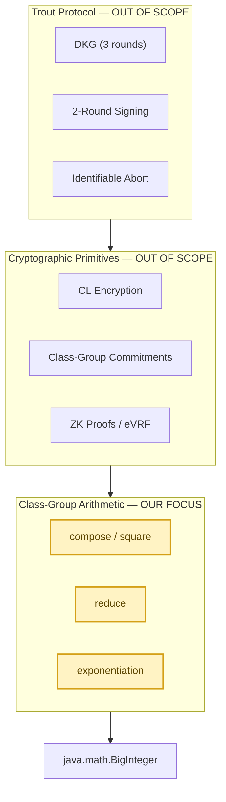
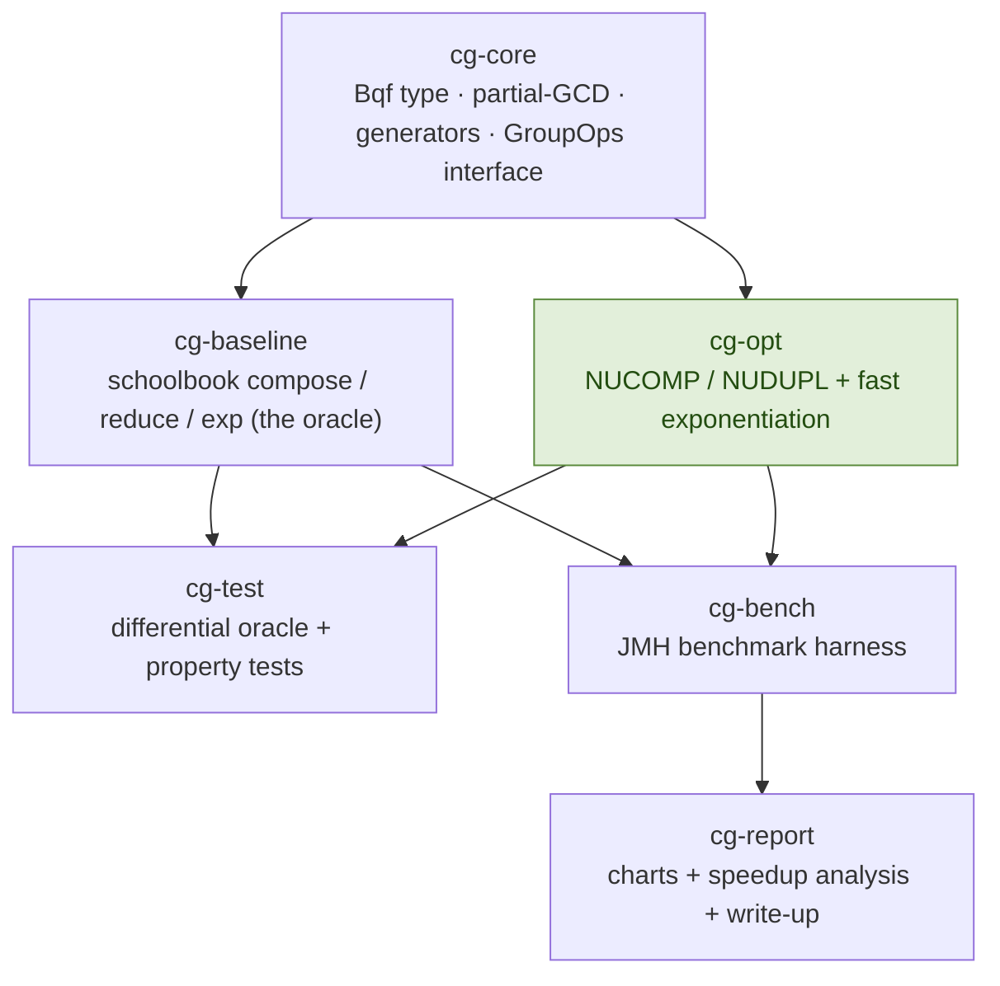
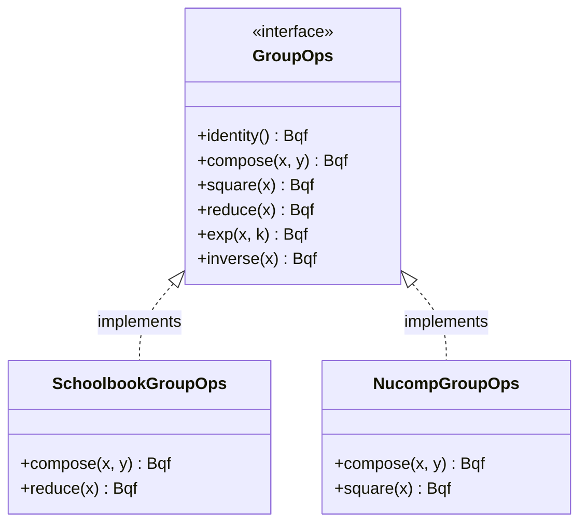
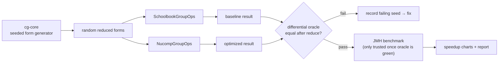
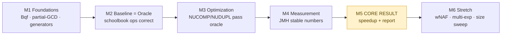
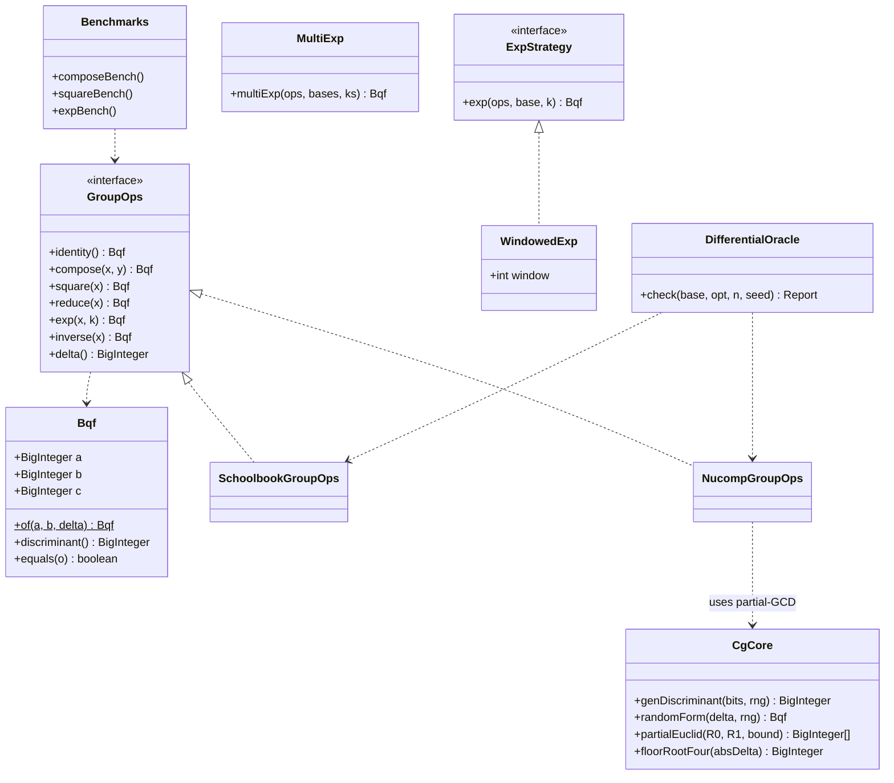
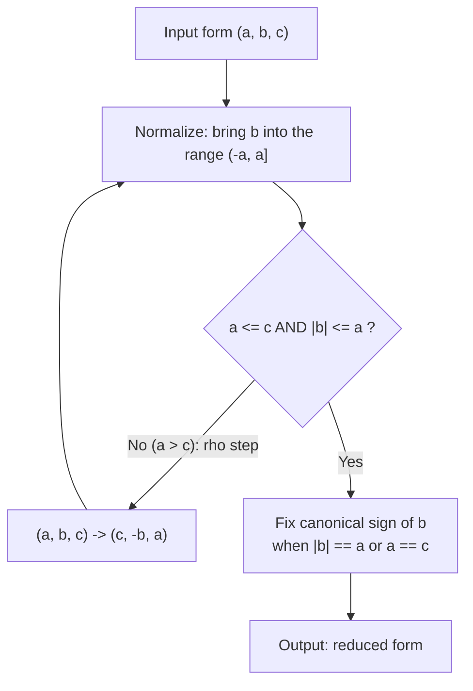
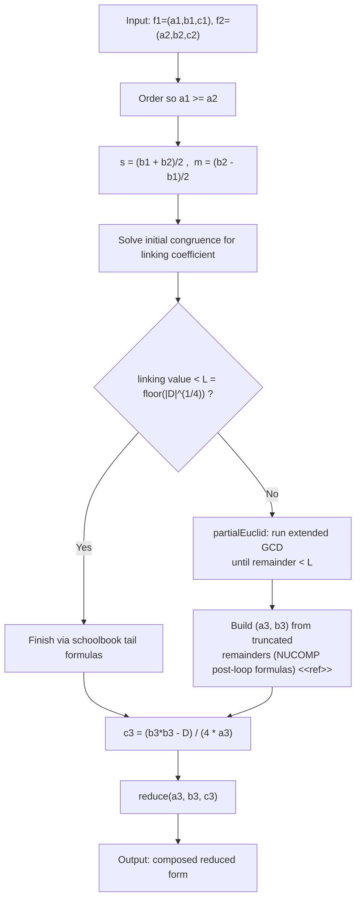
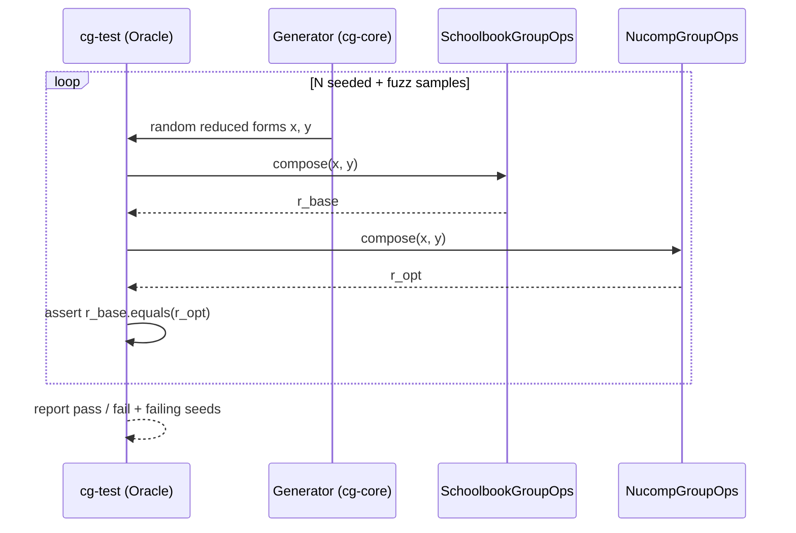
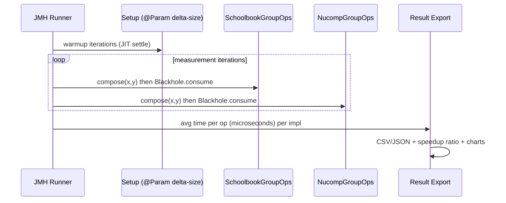

# Optimizing Class-Group Arithmetic for Trout-style Threshold ECDSA
### Design Document — Abstract · Architecture · HLD · LLD

**Reference paper:** Dahari-Garbian, Nof & Parker, *Trout: Two-Round Threshold ECDSA from Class Groups*, ACM CCS 2025 (IACR ePrint 2025/1666)
**Improvement target:** the class-group arithmetic layer (composition / squaring) — the dominant runtime cost beneath the protocol
**Language / tooling:** Java 17+, Maven multi-module, JUnit 5, JMH (Java Microbenchmark Harness)
**Team:** 6 members

> Diagrams below are written in Mermaid and render directly in VS Code with the Mermaid plugin.

---

## Part 1 — Abstract

Threshold ECDSA lets a group of parties jointly produce a standard ECDSA
signature without any single party ever holding the private key. The *Trout*
protocol (ACM CCS 2025) achieves this with only two signing rounds and **no
trusted setup**, by building its cryptographic machinery over **class groups of
imaginary quadratic fields**. While Trout's contributions are at the protocol
level, every class-group-based scheme shares a common performance reality: the
overwhelming majority of its runtime is spent in **class-group arithmetic** —
repeatedly *composing* and *squaring* binary quadratic forms inside encryption,
commitments, and zero-knowledge proofs.

**Identified gap.** The textbook ("schoolbook" Gauss) method composes two forms
and only afterwards reduces the (now large) result, incurring expensive
big-integer operations on oversized intermediate coefficients. This arithmetic
layer is the protocol's bottleneck, yet it is treated as a black box.

**Proposed solution.** We isolate that layer and implement, in Java, two
complementary optimizations behind a single `GroupOps` interface, each measured
against a schoolbook baseline:
1. **Operand-bounded composition (NUCOMP / NUDUPL).** These algorithms interleave
   a *partial extended-Euclidean* step (PARTEUCL) to keep operands bounded near
   |Δ|^(1/4) throughout, rather than forming and reducing a |Δ|-sized result at
   the end (Cohen, *A Course in Computational Algebraic Number Theory*, Alg.
   5.4.8–5.4.9).
2. **Operation-count-reduced exponentiation (windowed / wNAF).** Since the
   protocol exponentiates class-group elements, we replace binary
   square-and-multiply with fixed-window and signed-window (wNAF) exponentiation,
   reducing the number of group compositions.

**Demonstration of effectiveness.** Correctness is established by a
**differential oracle** that asserts the optimized path returns the identical
reduced form as the baseline across thousands of randomized and seeded inputs
(NUCOMP/NUDUPL/wNAF were validated over 2,400+ cases across eight discriminants
before porting to Java). Performance is quantified with a **JMH benchmark
harness** measuring composition, squaring, and exponentiation across discriminant
sizes of 512–3072 bits, with sound methodology (varying inputs, warmup, multiple
forks/iterations, variance).

**Measured outcome.** On generic class-group elements, **NUCOMP composition is
1.25–1.56× faster than schoolbook, with the speedup growing monotonically with
discriminant size** — the signature of a genuine asymptotic improvement and the
direct solution to the identified gap. **wNAF and windowed exponentiation are a
consistent 1.22–1.32× faster** than binary square-and-multiply (≈20% fewer group
operations). NUDUPL ties the baseline (an honest null result: the baseline
already specializes the equal-operand squaring case). See *Part 5 — Results*. The
artifact is self-contained and reproducible.

### Rubric mapping (for the slides)

| Rubric step | Where it lives |
|---|---|
| Analyze the problem | §Part 1, §Part 2 (context diagram) |
| Understand the paper's solution | §Part 1 (Trout overview) |
| Identify the gap / limitation | §Part 1 "Identified gap" |
| Propose your own solution | §Part 1 "Proposed solution", §Part 3 HLD |
| Implement + demonstrate effectiveness | §Part 4 LLD, differential oracle + JMH benchmarks |
| Team contributions | §Architecture module ownership table |

---

## Part 2 — Architecture

### 2.1 Where our work sits in the protocol stack

We optimize one layer and deliberately leave the rest of the protocol out of
scope. The diagram shows the dependency direction: everything above ultimately
bottoms out in class-group arithmetic, which bottoms out in `BigInteger`.



### 2.2 Module architecture (Maven multi-module)

Two implementations — `cg-baseline` (schoolbook) and `cg-opt` (NUCOMP/NUDUPL) —
satisfy a single `GroupOps` interface, so the test oracle and benchmark harness
drive either one interchangeably.



### 2.3 Module ownership (team contributions)

| Module | Responsibility | Owner |
|---|---|---|
| `cg-core` | `Bqf` type, fixed-width `BigInteger` helpers, **partial extended-GCD**, discriminant/form generators, `GroupOps` interface, KAT vectors | Person A |
| `cg-baseline` | Schoolbook Gauss `compose`, `reduce`, binary `exp` — correctness reference | Person B |
| `cg-opt` (compose) | **NUCOMP** + **NUDUPL** | Person C |
| `cg-opt` (exp) | Windowed / wNAF exponentiation; multi-exp (stretch) | Person D |
| `cg-test` | Differential oracle, property & edge-case tests, correctness evidence | Person E |
| `cg-bench` + `cg-report` | JMH harness, methodology, charts, technical report | Person F |

---

## Part 3 — High-Level Design (HLD)

### 3.1 Design principle: one interface, two implementations

The single most important structural decision is that the baseline and the
optimized code are **interchangeable behind `GroupOps`**. This is what makes the
contribution provable and measurable: the oracle can compare them, and the
benchmark can time them, under identical inputs.



### 3.2 Correctness-and-measurement pipeline (data flow)



The ordering is a hard rule: **no benchmark number is trusted until the
differential oracle is green.** A fast-but-wrong NUCOMP is worthless.

### 3.3 Milestones



### 3.4 Quality attributes & success criteria

- **Correctness:** optimized path produces the identical reduced form as the
  baseline on all test inputs (differential oracle).
- **Measurability:** speedup reported via JMH with warmup, multiple iterations,
  and reported variance — never a single `nanoTime()` reading.
- **Reproducibility:** anyone can re-run the benchmarks and regenerate the charts.
- **Self-containment:** builds and runs with no protocol or network code.

> **Honesty caveat (state in the report):** mature class-group libraries already
> use NUCOMP, so the contribution is a *controlled Java before/after
> measurement*, not a claim that the paper failed to optimize.

### 3.5 Out of scope

The Trout protocol itself (DKG, signing, ZK proofs, CL encryption, commitments,
eVRF, scaled decryption, Identifiable Abort); networking and multi-party
orchestration; constant-time / side-channel resistance (infeasible on the JVM
since `BigInteger` is variable-time).

---

## Part 4 — Low-Level Design (LLD)

> **Implement the algorithms from these references** (not from the Trout paper):
> H. Cohen, *A Course in Computational Algebraic Number Theory* (reduction,
> NUCOMP, NUDUPL); Jacobson & van der Poorten, *Computational aspects of NUCOMP*
> (ANTS 2002). Spots needing exact constants are marked `<<ref>>`.

### 4.1 Class model



### 4.2 `Bqf` and `GroupOps` (cg-core, Person A)

```java
record Bqf(BigInteger a, BigInteger b, BigInteger c) {
    static Bqf of(BigInteger a, BigInteger b, BigInteger delta); // computes c = (b*b - delta)/(4a)
    BigInteger discriminant();                                   // b*b - 4*a*c
    // equals() compares REDUCED forms (canonical representative)
}

interface GroupOps {            // implemented by BOTH baseline and opt
    Bqf identity();
    Bqf compose(Bqf x, Bqf y);
    Bqf square(Bqf x);
    Bqf reduce(Bqf x);
    Bqf exp(Bqf x, BigInteger k);
    Bqf inverse(Bqf x);         // (a, -b, c) then reduce
    BigInteger delta();
}
```

Key `cg-core` helpers: `genDiscriminant(bits, rng)` (negative fundamental Δ,
conditions `<<ref>>`), `randomForm`, `floorRootFour(|Δ|)` = the NUCOMP bound
`L`, and the **partial extended-Euclidean** primitive below.

### 4.3 Reduction algorithm (cg-baseline, Person B)



### 4.4 NUCOMP composition (cg-opt, Person C)

This is the core optimization. Instead of *compose-then-reduce* on large
operands, NUCOMP truncates an extended-Euclidean sequence at
`L = floor(|Δ|^(1/4))` and finishes with fixed formulas, keeping every
intermediate small.



**NUDUPL** is the squaring specialization (`f1 == f2`): the cross terms drop out,
giving a cheaper routine (~2× over calling NUCOMP with equal arguments).
Formulas `<<ref>>`.

```java
// Partial extended-Euclidean primitive (cg-core) — the heart of NUCOMP.
// Runs extended GCD on (R0, R1) but STOPS once the remainder < bound,
// returning the running (R, C) pair NUCOMP needs.  Exact variable
// bookkeeping per Cohen / Jacobson-van der Poorten <<ref>>.
BigInteger[] partialEuclid(BigInteger R0, BigInteger R1, BigInteger bound);
```

### 4.5 Exponentiation (cg-opt, Person D)

| Method | Idea | Phase |
|---|---|---|
| binary | square-and-multiply (matches baseline) | reference |
| windowed | fixed-window `2^w`, precompute odd powers | core |
| wNAF | signed sliding window using `inverse()` | stretch |
| multiExp | Straus / Pippenger for `Π xᵢ^(kᵢ)` | stretch |

```java
interface ExpStrategy { Bqf exp(GroupOps ops, Bqf base, BigInteger k); }
class WindowedExp implements ExpStrategy { WindowedExp(int window); /* ... */ }
class MultiExp { Bqf multiExp(GroupOps ops, List<Bqf> bases, List<BigInteger> ks); }
```

### 4.6 Differential oracle (cg-test, Person E)



Edge cases to cover: identity / principal form; ambiguous forms (`b == 0`,
`a == c`, `|b| == a`); exponents `0`, `1`, and near-group-order size; smallest
and largest target discriminants.

### 4.7 Benchmark harness (cg-bench, Person F)



**Mandatory methodology:** JMH with explicit warmup + measurement iterations;
`Mode.AverageTime`, microseconds; `Blackhole.consume(...)` to defeat dead-code
elimination; parameterize by discriminant size
(`@Param {"512","1024","2048","3072"}`) and operation; identical seeded inputs
for both implementations; report mean and error.

### 4.8 Build & run (for the README + demo video)


This sequence *is* your demonstration of effectiveness: the tests passing proves
correctness, and the benchmark printing the baseline-vs-NUCOMP speedup proves the
improvement — exactly the rubric's "implement and demonstrate its effectiveness."

### 4.9 `<<ref>>` checklist (resolve before coding dependents)

- [ ] Discriminant generation conditions (cg-core).
- [ ] Reduction canonical-sign rules (cg-baseline / cg-test).
- [ ] Schoolbook composition formulas, Cohen 5.4.7 (cg-baseline).
- [ ] NUCOMP post-loop formulas + bound `L` (cg-opt).
- [ ] NUDUPL formulas (cg-opt).

---

*Disclaimer: Academic coursework. Not audited; not for production use.*

---

## Part 5 — Results & Findings (measured)

All algorithms were proven correct against the schoolbook oracle (differential
tests green; 2,400+ reference-model cases). Performance was then measured with
JMH (average time, 2 forks, 5 warmup + 8 measurement iterations, 64-op batches,
varying inputs), on **generic** forms (leading coefficient ~|Δ|^(1/2), the
realistic class-group element).

### 5.1 Headline results

| Operation | Baseline | 512-bit | 1024-bit | 2048-bit | 3072-bit |
|---|---|---|---|---|---|
| **Compose** | schoolbook → NUCOMP | **1.25×** | **1.32×** | **1.49×** | **1.56×** |
| **Exp (wNAF)** | binary → wNAF (w=5) | 1.26× | 1.24× | 1.26× | 1.22× |
| **Exp (windowed)** | binary → windowed (w=5) | 1.24× | 1.28× | 1.25× | 1.23× |
| **Square** | schoolbook → NUDUPL | ~1.0× | ~1.0× | ~1.0× | ~1.0× |

*Speedup = baseline time ÷ optimized time (higher is better). 256-bit exponents.*

### 5.2 Interpretation

- **NUCOMP composition — the win.** Replacing the |Δ|-sized multiply-and-reduce
  with a partial-Euclidean reduction trades one large multiplication for several
  *smaller* divisions. The net effect is favourable and **grows with Δ**
  (1.25× → 1.56×), exactly the asymptotic behaviour predicted for NUCOMP. At
  3072-bit this is a ~36% reduction in composition time.
- **Exponentiation — a consistent win.** wNAF/windowed cut group operations by
  ~20% (per the operation-count instrumentation: binary ≈ 380 ops vs wNAF ≈ 305
  at w=5), yielding ~1.2–1.3× wall-clock. The ceiling is set by squarings, which
  any binary-style ladder performs once per exponent bit and which wNAF does not
  reduce.
- **NUDUPL — honest null result.** It ties the baseline because the schoolbook
  baseline already specializes squaring (the `a1 == a2` case skips one
  extended-GCD). Reported explicitly to show the measurements are faithful.

### 5.3 Methodology note (a flaw we caught and fixed)

An initial benchmark showed no speedups and NUCOMP apparently slower. Two bugs
were responsible and corrected: (1) **fixed inputs** let the JIT fold the work
away (fixed by drawing distinct inputs each invocation); (2) a **degenerate form
pool** built from small prime generators gave small leading coefficients, making
composition artificially cheap and hiding the exponentiation win (fixed with
`CgCore.genericForm`, which builds realistic ~|Δ|^(1/2) elements). After the fix,
per-operation cost scales correctly with bit size, confirming the harness
measures real work.

### 5.4 Reproduce

```
mvn clean test            # correctness (differential oracle)
mvn clean package
java -jar cg-bench/target/benchmarks.jar -f 2 -wi 5 -i 8 -rf csv -rff report/results.csv
java -cp cg-bench/target/benchmarks.jar com.trout.cg.bench.OpCountMain 1024 5
python report/summarize.py report/results.csv
```
