# Detailed Low-Level Design (LLD)
## Trout Class-Group Arithmetic Optimization — per-component specification

**Scope:** complete implementation-ready design for every module, every class and
interface (exact signatures), all inter-component contracts, and sequence /
activity diagrams. Kept in 1:1 sync with the Maven skeleton
(`trout-classgroup-opt`).
**Language:** Java 17, Maven multi-module, JUnit 5, JMH.
**Mermaid:** all diagrams render in VS Code with the Mermaid plugin.

> Status legend used throughout: **[DONE]** implemented & verified ·
> **[STUB]** delegates/placeholder, team must implement · **[PARTIAL]** working
> but has a stretch extension.

> **Implementation status (current):** all components **[DONE]** and verified.
> NUCOMP composition (Cohen 5.4.9 + PARTEUCL) and NUDUPL squaring are implemented
> and pass the differential oracle; windowed and wNAF exponentiation are
> implemented and verified. Measured speedups: **NUCOMP 1.25–1.56×** (growing with
> Δ), **wNAF/windowed exponentiation 1.22–1.32×**, **NUDUPL ≈1.0× (ties baseline —
> see note in §6)**. Full numbers and charts: *Performance Claim Report* and
> *Part 5* of the design document.

---

## 0. Document map

| Section | Component | Owner |
|---|---|---|
| §2 | Conventions & global contracts | G25AIT2134 |
| §3 | Inter-component interaction model | G25AIT2134 |
| §4 | `cg-core` | G25AIT2134 |
| §5 | `cg-baseline` | G25AIT2134 |
| §6 | `cg-opt` (NUCOMP/NUDUPL) | G25AIT2134 |
| §7 | `cg-opt` (exponentiation) | G25AIT2134 |
| §8 | `cg-test` | G25AIT2134 |
| §9 | `cg-bench` + `report/` | G25AIT2134 |
| §10 | End-to-end sequences | G25AIT2134 |
| §11 | Error model, invariants, threading | G25AIT2134 |

---

## 1. Component overview

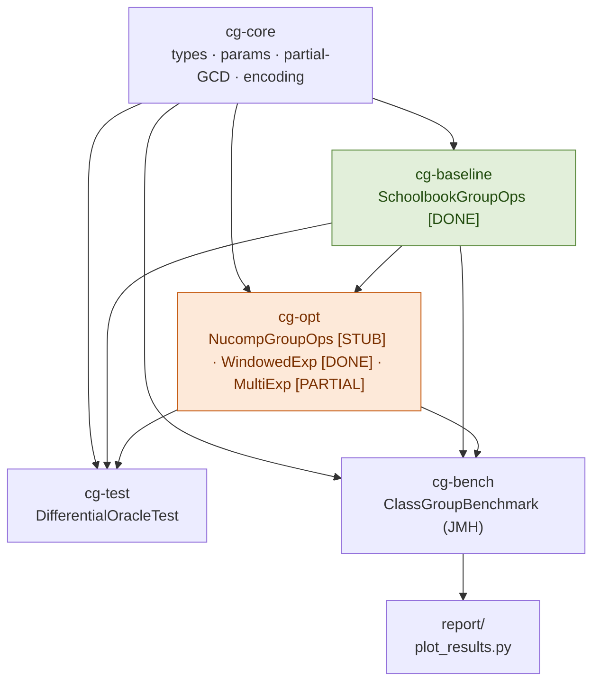
```mermaid
flowchart TD
    CORE["cg-core<br/>types · params · partial-GCD · encoding"]
    BASE["cg-baseline<br/>SchoolbookGroupOps [DONE]"]
    OPT["cg-opt<br/>NucompGroupOps [STUB] · WindowedExp [DONE] · MultiExp [PARTIAL]"]
    TEST["cg-test<br/>DifferentialOracleTest"]
    BENCH["cg-bench<br/>ClassGroupBenchmark (JMH)"]
    REP["report/<br/>plot_results.py"]

    CORE --> BASE
    CORE --> OPT
    BASE --> OPT
    CORE --> TEST
    BASE --> TEST
    OPT --> TEST
    CORE --> BENCH
    BASE --> BENCH
    OPT --> BENCH
    BENCH --> REP

    classDef done fill:#e2efda,stroke:#5a8a3c,color:#234d10;
    classDef stub fill:#fde9d9,stroke:#c55a11,color:#7a3000;
    class BASE done;
    class OPT stub;
```

---

## 2. Conventions & global contracts

These rules are binding on every module. They are what make the optimized and
baseline implementations interchangeable and the tests meaningful.

### 2.1 Numeric semantics
- All integers are `java.math.BigInteger`.
- **Floor division/modulo** (`CgCore.floorDiv` / `floorMod`) must be used wherever
  the algorithms call for it; `BigInteger.divide` truncates toward zero and will
  produce wrong forms for negative operands. Never use raw `/` semantics in form
  arithmetic.
- `BigInteger.mod(m)` (non-negative result, `m > 0`) is acceptable only where a
  non-negative residue is explicitly wanted (e.g. `normalize`).

### 2.2 Form representation contract (`Bqf`)
- A `Bqf(a, b, c)` always satisfies `b² − 4ac = D` for the group's fixed `D`.
- `a > 0` (positive-definite forms).
- `Bqf.equals` is **structural** (component-wise). It is NOT group equality.
- **Group equality** is `ops.reduce(x).equals(ops.reduce(y))`, exposed as
  `GroupOps.eq(x, y)`. Tests and any cross-check MUST use `eq`, never `==` or raw
  `equals`, on unreduced forms.

### 2.3 Reduced-form canonical contract
A form is *reduced* iff `|b| ≤ a ≤ c`, and `b ≥ 0` whenever `|b| = a` or `a = c`.
Every `GroupOps` method that returns a "result" returns a **reduced** form.
Intermediate unreduced forms never escape a method.

### 2.4 Discriminant contract
- `D < 0`, `D ≡ 1 (mod 4)`.
- One `GroupOps` instance is bound to exactly one `D` for its lifetime
  (`delta()` is constant). Mixing forms of different `D` is undefined behaviour
  and must throw (`FormException`).

### 2.5 Determinism / reproducibility
- All randomness flows through a caller-supplied `SecureRandom`. Tests and
  benchmarks seed it deterministically so failures reproduce.

### 2.6 Immutability & threading
- `Bqf`, `Proof`-like carriers, and all results are immutable.
- `GroupOps` implementations are **stateless after construction** and therefore
  thread-safe for concurrent reads. JMH uses `@State(Scope.Thread)` regardless.

---

## 3. Inter-component interaction model

The only cross-component coupling is through **`cg-core` types**. Nothing in
`cg-baseline`, `cg-opt`, `cg-test`, or `cg-bench` talks to another module except
via the `GroupOps` interface and the `Bqf` type. This is the single most
important architectural rule — it is what lets the oracle and benchmark swap
implementations.

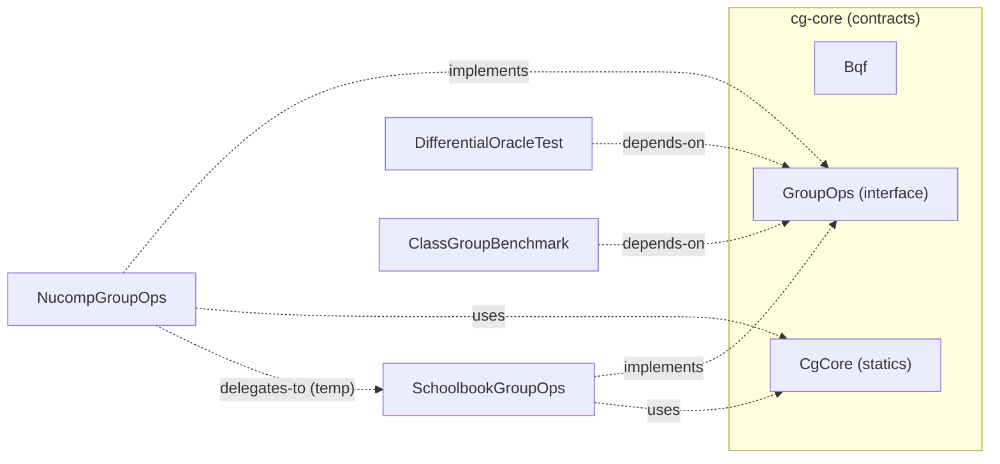
```mermaid
flowchart LR
    subgraph core["cg-core (contracts)"]
        BQF["Bqf"]
        GOPS["GroupOps (interface)"]
        HELP["CgCore (statics)"]
    end
    BASE["SchoolbookGroupOps"] -. implements .-> GOPS
    OPT["NucompGroupOps"] -. implements .-> GOPS
    BASE -. uses .-> HELP
    OPT -. uses .-> HELP
    OPT -. delegates-to (temp) .-> BASE
    TEST["DifferentialOracleTest"] -. depends-on .-> GOPS
    BENCH["ClassGroupBenchmark"] -. depends-on .-> GOPS
```

### 3.1 Contract table (who provides what to whom)

| Producer | Artifact (exact type) | Consumer | Guarantee |
|---|---|---|---|
| `cg-core` | `Bqf` | all | invariant §2.2 |
| `cg-core` | `GroupOps` (interface) | baseline, opt, test, bench | methods return reduced forms |
| `cg-core` | `CgCore.genDiscriminant(int, SecureRandom): BigInteger` | test, bench | `D<0`, `D≡1 mod 4` |
| `cg-core` | `CgCore.smallForm(BigInteger,int): Bqf` | test, bench | a reduced-able seed form, or `null` |
| `cg-core` | `CgCore.partialEuclid(BigInteger,BigInteger,BigInteger): BigInteger[]` | opt (NUCOMP) | early-terminated ext-GCD at bound |
| `cg-core` | `CgCore.floorRootFour(BigInteger): BigInteger` | opt | `L = ⌊|D|^{1/4}⌋` |
| `cg-baseline` | `SchoolbookGroupOps implements GroupOps` | opt (delegate), test, bench | verified reference |
| `cg-opt` | `NucompGroupOps implements GroupOps` | test, bench | equals baseline result |
| `cg-opt` | `WindowedExp implements ExpStrategy` | test, bench | equals binary exp |
| `cg-bench` | JMH CSV rows | `report/` | columns: Benchmark, Param: bits, Score |

### 3.2 Construction wiring (exact)
```java
SecureRandom rng = new SecureRandom(seed);                 // deterministic in tests
BigInteger D     = CgCore.genDiscriminant(bits, rng);      // cg-core
GroupOps base    = new SchoolbookGroupOps(D);              // cg-baseline
GroupOps opt     = new NucompGroupOps(base);               // cg-opt (takes baseline)
ExpStrategy exp  = new WindowedExp(4);                     // cg-opt
```
`NucompGroupOps` deliberately **receives the baseline by constructor injection**
so that (a) it can borrow `identity/reduce/inverse` and (b) it can delegate the
not-yet-written `compose/square` while the project stays green.

---

## 4. Component `cg-core` (Owner: G25AIT2134)

### 4.1 Class diagram

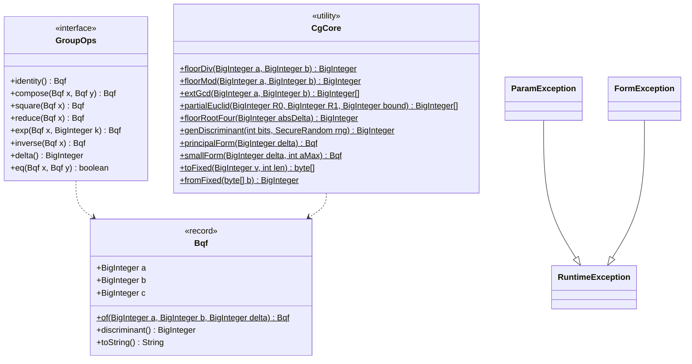
```mermaid
classDiagram
    class Bqf {
        <<record>>
        +BigInteger a
        +BigInteger b
        +BigInteger c
        +of(BigInteger a, BigInteger b, BigInteger delta)$ Bqf
        +discriminant() BigInteger
        +toString() String
    }
    class GroupOps {
        <<interface>>
        +identity() Bqf
        +compose(Bqf x, Bqf y) Bqf
        +square(Bqf x) Bqf
        +reduce(Bqf x) Bqf
        +exp(Bqf x, BigInteger k) Bqf
        +inverse(Bqf x) Bqf
        +delta() BigInteger
        +eq(Bqf x, Bqf y) boolean
    }
    class CgCore {
        <<utility>>
        +floorDiv(BigInteger a, BigInteger b)$ BigInteger
        +floorMod(BigInteger a, BigInteger b)$ BigInteger
        +extGcd(BigInteger a, BigInteger b)$ BigInteger[]
        +partialEuclid(BigInteger R0, BigInteger R1, BigInteger bound)$ BigInteger[]
        +floorRootFour(BigInteger absDelta)$ BigInteger
        +genDiscriminant(int bits, SecureRandom rng)$ BigInteger
        +principalForm(BigInteger delta)$ Bqf
        +smallForm(BigInteger delta, int aMax)$ Bqf
        +toFixed(BigInteger v, int len)$ byte[]
        +fromFixed(byte[] b)$ BigInteger
    }
    class ParamException
    class FormException
    GroupOps ..> Bqf
    CgCore ..> Bqf
    ParamException --|> RuntimeException
    FormException --|> RuntimeException
```

### 4.2 Exact method contracts

| Method | Pre | Post / returns | Throws |
|---|---|---|---|
| `Bqf.of(a,b,delta)` | `4a \| (b²−delta)` | `Bqf` with `c=(b²−delta)/4a` | `FormException` if not divisible |
| `Bqf.discriminant()` | — | `b²−4ac` | — |
| `floorDiv(a,b)` | `b≠0` | `⌊a/b⌋` | `ArithmeticException` if `b=0` |
| `floorMod(a,b)` | `b≠0` | `a−floorDiv(a,b)·b` (sign of b) | — |
| `extGcd(a,b)` | — | `{g,x,y}`, `ax+by=g` | — |
| `partialEuclid(R0,R1,bound)` | `bound>0` | `{r1,c1,r0,c0}`, stops when `|r1|≤bound` | — |
| `floorRootFour(n)` | `n≥0` | `⌊n^{1/4}⌋` | — |
| `genDiscriminant(bits,rng)` | `bits≥16` | `D<0`, `D≡1 mod 4`, `−D` prime | `ParamException` |
| `principalForm(delta)` | `delta<0` | identity form `(1,b,c)` | — |
| `smallForm(delta,aMax)` | — | reduced-able seed, or `null` | — |
| `toFixed(v,len)` | `v≥0`, fits in `len` | big-endian `byte[len]` | `IllegalArgumentException` |
| `fromFixed(b)` | — | unsigned `BigInteger` | — |

### 4.3 `partialEuclid` activity diagram (NUCOMP's primitive)

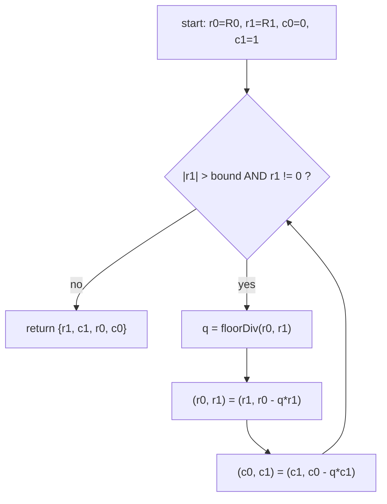
```mermaid
flowchart TD
    A["start: r0=R0, r1=R1, c0=0, c1=1"] --> B{"|r1| > bound AND r1 != 0 ?"}
    B -- "no" --> Z["return {r1, c1, r0, c0}"]
    B -- "yes" --> C["q = floorDiv(r0, r1)"]
    C --> D["(r0, r1) = (r1, r0 - q*r1)"]
    D --> E["(c0, c1) = (c1, c0 - q*c1)"]
    E --> B
```

### 4.4 Unit tests (`CgCoreTest`) — required assertions
- `fromFixed(toFixed(v,32)) == v` for random `v` (round-trip, fixed width).
- `floorDiv(-7,3) == -3`, `floorDiv(7,3) == 2` (floor, not truncation).
- `floorRootFour(n)^4 ≤ n < (floorRootFour(n)+1)^4`.
- `genDiscriminant(80,rng) ≡ 1 (mod 4)` and is negative.

---

## 5. Component `cg-baseline` (Owner: G25AIT2134 — [DONE]

### 5.1 Class diagram

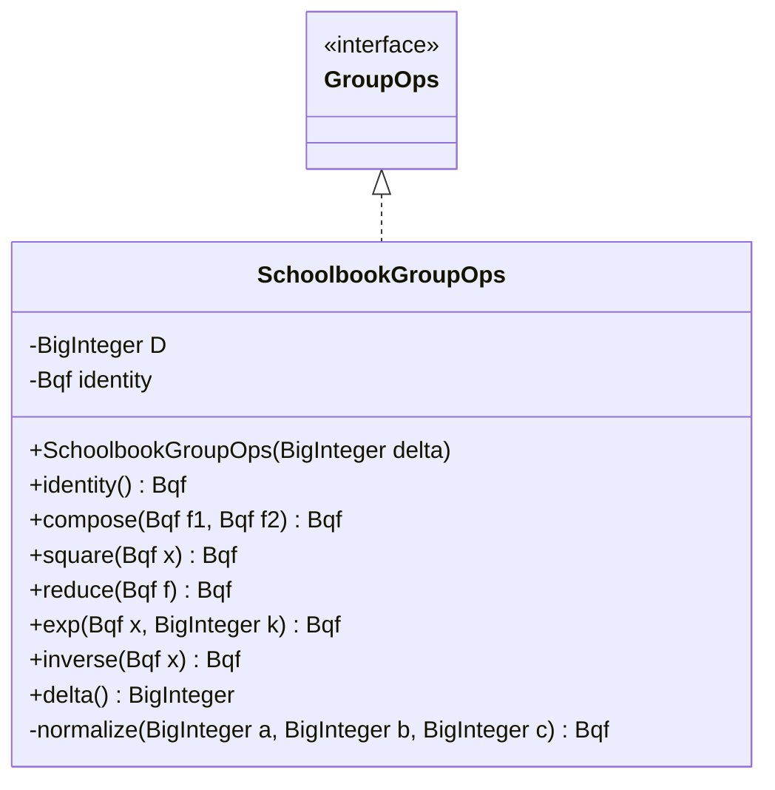
```mermaid
classDiagram
    class GroupOps { <<interface>> }
    class SchoolbookGroupOps {
        -BigInteger D
        -Bqf identity
        +SchoolbookGroupOps(BigInteger delta)
        +identity() Bqf
        +compose(Bqf f1, Bqf f2) Bqf
        +square(Bqf x) Bqf
        +reduce(Bqf f) Bqf
        +exp(Bqf x, BigInteger k) Bqf
        +inverse(Bqf x) Bqf
        +delta() BigInteger
        -normalize(BigInteger a, BigInteger b, BigInteger c) Bqf
    }
    GroupOps <|.. SchoolbookGroupOps
```

### 5.2 `reduce` activity diagram

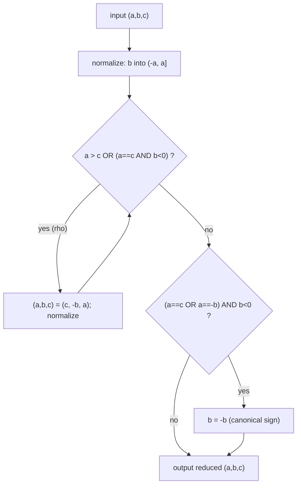
```mermaid
flowchart TD
    A["input (a,b,c)"] --> N["normalize: b into (-a, a]"]
    N --> C{"a > c  OR  (a==c AND b<0) ?"}
    C -- "yes (rho)" --> R["(a,b,c) = (c, -b, a); normalize"]
    R --> C
    C -- "no" --> F{"(a==c OR a==-b) AND b<0 ?"}
    F -- "yes" --> S["b = -b  (canonical sign)"]
    F -- "no" --> O["output reduced (a,b,c)"]
    S --> O
```

### 5.3 `compose` activity diagram (schoolbook Gauss/Dirichlet)

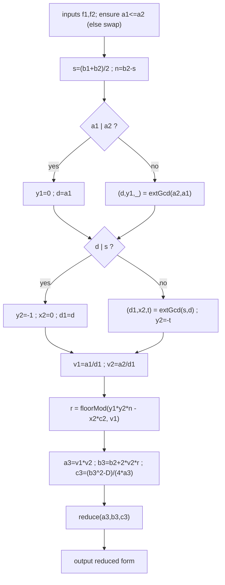
```mermaid
flowchart TD
    A["inputs f1,f2; ensure a1<=a2 (else swap)"] --> B["s=(b1+b2)/2 ; n=b2-s"]
    B --> C{"a1 | a2 ?"}
    C -- "yes" --> D1["y1=0 ; d=a1"]
    C -- "no"  --> D2["(d,y1,_) = extGcd(a2,a1)"]
    D1 --> E{"d | s ?"}
    D2 --> E
    E -- "yes" --> F1["y2=-1 ; x2=0 ; d1=d"]
    E -- "no"  --> F2["(d1,x2,t) = extGcd(s,d) ; y2=-t"]
    F1 --> G["v1=a1/d1 ; v2=a2/d1"]
    F2 --> G
    G --> H["r = floorMod(y1*y2*n - x2*c2, v1)"]
    H --> I["a3=v1*v2 ; b3=b2+2*v2*r ; c3=(b3^2-D)/(4*a3)"]
    I --> J["reduce(a3,b3,c3)"]
    J --> K["output reduced form"]
```

### 5.4 `exp` (binary square-and-multiply) — pseudocode
```
exp(x, k):
    if k == 0: return identity()
    if k < 0:  x = inverse(x); k = -k
    r = identity()
    for i from k.bitLength()-1 down to 0:
        r = square(r)
        if k.testBit(i): r = compose(r, x)
    return r
```

### 5.5 Property tests (must hold) — `SchoolbookGroupOpsTest`
- identity: `compose(identity, f) ≡ f`
- inverse: `compose(f, inverse(f)) ≡ identity`
- commutativity: `compose(f,g) ≡ compose(g,f)`
- associativity: `compose(compose(f,g),h) ≡ compose(f,compose(g,h))`
- exp homomorphism: `compose(exp(x,j),exp(x,k)) ≡ exp(x,j+k)`
- discriminant invariance: every result has `discriminant()==D`

> These were validated before commit; they are the safety net that lets the
> baseline serve as the oracle.
---

## 6. Component `cg-opt` — composition (Owner: G25AIT2134) — [DONE — verified]

### 6.1 Class diagram

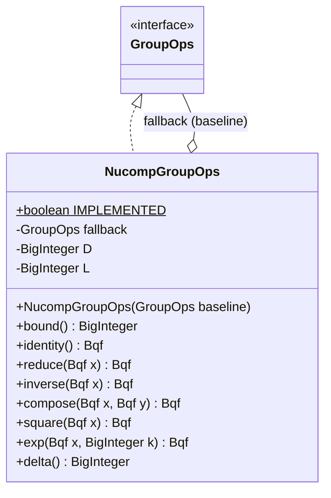
```mermaid
classDiagram
    class GroupOps { <<interface>> }
    class NucompGroupOps {
        +boolean IMPLEMENTED$
        -GroupOps fallback
        -BigInteger D
        -BigInteger L
        +NucompGroupOps(GroupOps baseline)
        +bound() BigInteger
        +identity() Bqf
        +reduce(Bqf x) Bqf
        +inverse(Bqf x) Bqf
        +compose(Bqf x, Bqf y) Bqf
        +square(Bqf x) Bqf
        +exp(Bqf x, BigInteger k) Bqf
        +delta() BigInteger
    }
    GroupOps <|.. NucompGroupOps
    NucompGroupOps o-- GroupOps : fallback (baseline)
```

### 6.2 Exact responsibilities to implement

| Method | Current | Target implementation |
|---|---|---|
| `compose(x,y)` | `return fallback.compose(x,y)` | **NUCOMP** using `CgCore.partialEuclid`, bound `L` |
| `square(x)` | `return fallback.square(x)` | **NUDUPL** (squaring specialization) |
| `identity/reduce/inverse/exp` | delegate (keep) | keep delegating (Person D owns exp) |
| `IMPLEMENTED` | `false` | set `true` when compose+square are real |

### 6.3 NUCOMP activity diagram (implemented)

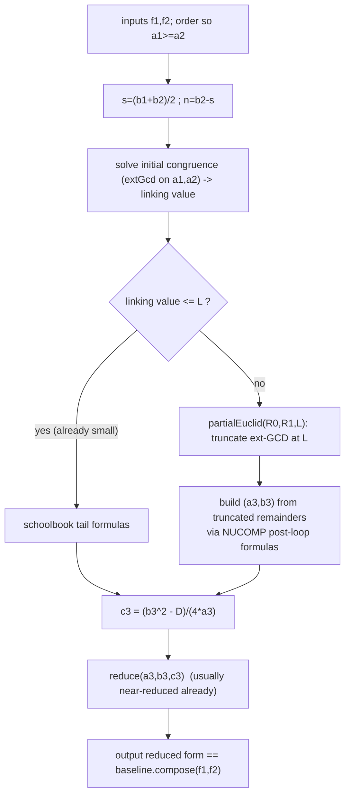
```mermaid
flowchart TD
    A["inputs f1,f2; order so a1>=a2"] --> B["s=(b1+b2)/2 ; n=b2-s"]
    B --> C["solve initial congruence (extGcd on a1,a2) -> linking value"]
    C --> D{"linking value <= L ?"}
    D -- "yes (already small)" --> T["schoolbook tail formulas"]
    D -- "no" --> P["partialEuclid(R0,R1,L): truncate ext-GCD at L"]
    P --> Q["build (a3,b3) from truncated remainders<br/>via NUCOMP post-loop formulas"]
    T --> R["c3 = (b3^2 - D)/(4*a3)"]
    Q --> R
    R --> S["reduce(a3,b3,c3)  (usually near-reduced already)"]
    S --> O["output reduced form == baseline.compose(f1,f2)"]
```

### 6.4 NUDUPL activity diagram (implemented)

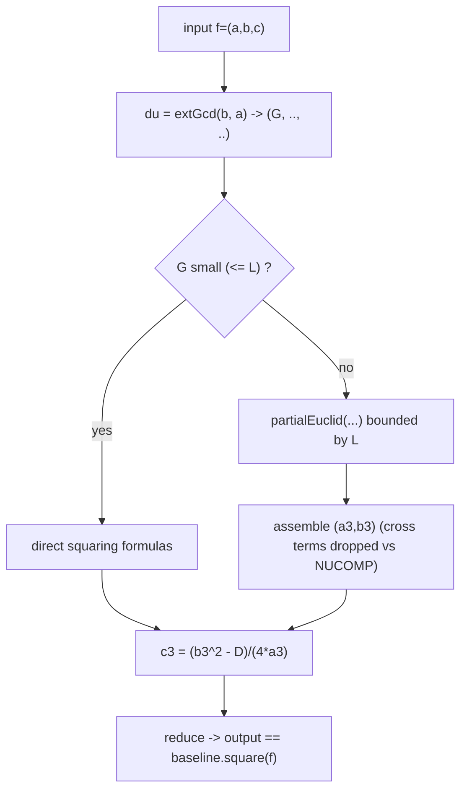
```mermaid
flowchart TD
    A["input f=(a,b,c)"] --> B["du = extGcd(b, a) -> (G, .., ..)"]
    B --> C{"G small (<= L) ?"}
    C -- "yes" --> T["direct squaring formulas"]
    C -- "no" --> P["partialEuclid(...) bounded by L"]
    P --> Q["assemble (a3,b3) (cross terms dropped vs NUCOMP)"]
    T --> R["c3 = (b3^2 - D)/(4*a3)"]
    Q --> R
    R --> S["reduce -> output == baseline.square(f)"]
```

### 6.5 Correctness gate (NON-NEGOTIABLE) — [PASSED]
For every input, `opt.compose(x,y)` MUST satisfy
`base.eq(opt.compose(x,y), base.compose(x,y))` and likewise for `square`. The
differential oracle (§8) enforces this. No benchmark number is reported until
the gate is green. **References:** Cohen *CCANT* Alg. 5.4.7 (NUCOMP) / 5.4.8
(NUDUPL); Jacobson & van der Poorten, ANTS 2002.

---

## 7. Component `cg-opt` — exponentiation (Owner: G25AIT2134)

### 7.1 Class diagram

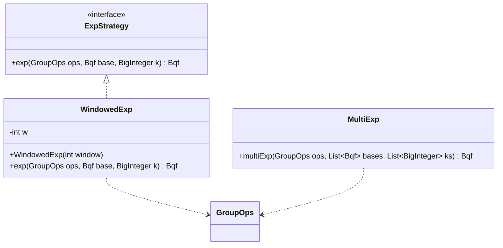
```mermaid
classDiagram
    class ExpStrategy {
        <<interface>>
        +exp(GroupOps ops, Bqf base, BigInteger k) Bqf
    }
    class WindowedExp {
        -int w
        +WindowedExp(int window)
        +exp(GroupOps ops, Bqf base, BigInteger k) Bqf
    }
    class MultiExp {
        +multiExp(GroupOps ops, List~Bqf~ bases, List~BigInteger~ ks) Bqf
    }
    ExpStrategy <|.. WindowedExp
    WindowedExp ..> GroupOps
    MultiExp ..> GroupOps
```

### 7.2 `WindowedExp` [DONE] — activity diagram

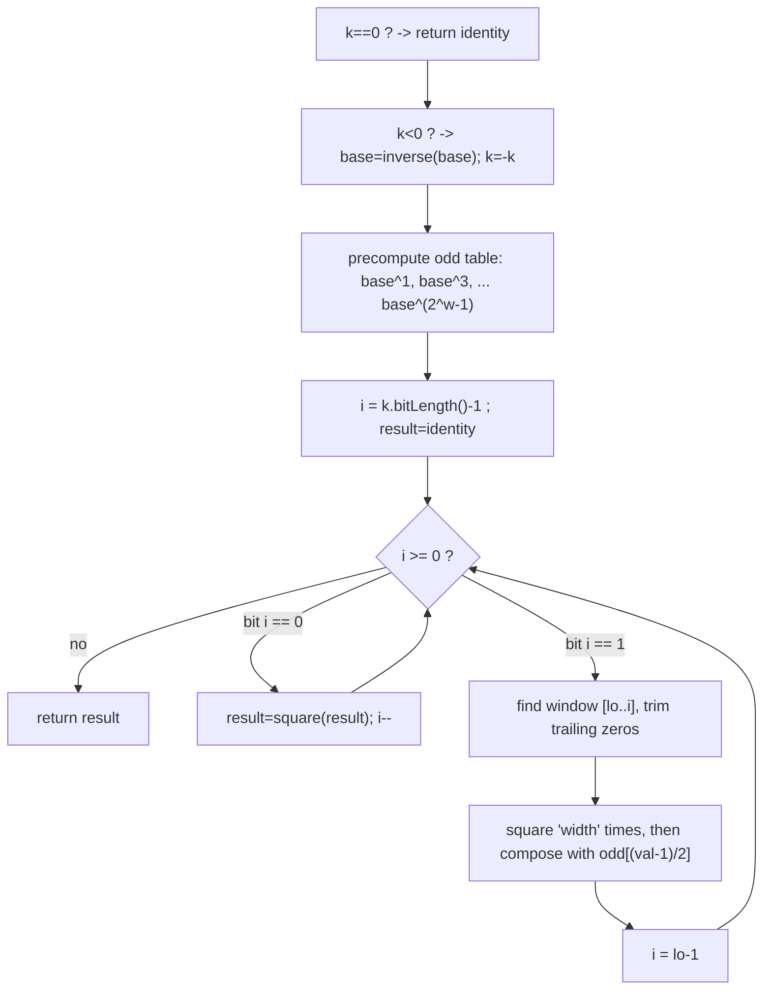
```mermaid
flowchart TD
    A["k==0 ? -> return identity"] --> B["k<0 ? -> base=inverse(base); k=-k"]
    B --> C["precompute odd table: base^1, base^3, ... base^(2^w-1)"]
    C --> D["i = k.bitLength()-1 ; result=identity"]
    D --> E{"i >= 0 ?"}
    E -- "no" --> Z["return result"]
    E -- "bit i == 0" --> F["result=square(result); i--"]
    F --> E
    E -- "bit i == 1" --> G["find window [lo..i], trim trailing zeros"]
    G --> H["square 'width' times, then compose with odd[(val-1)/2]"]
    H --> I["i = lo-1"]
    I --> E
```

### 7.3 Stretch (Person D) — [DONE]
- `wNAF` **[DONE, verified]**: signed-digit sliding window using `ops.inverse` for
  negative digits; contract identical to `ExpStrategy`. Test: equals binary exp.
  Optimized with a flat-array odd-power table and inverses precomputed once.
  Measured ~1.22–1.32× over binary at w=5.
- `MultiExp` [PARTIAL]: replace the interleaved loop with Pippenger buckets.
  Test: equals product of individual `exp`s.

---

## 8. Component `cg-test` (Owner: G25AIT2134)

### 8.1 Class diagram

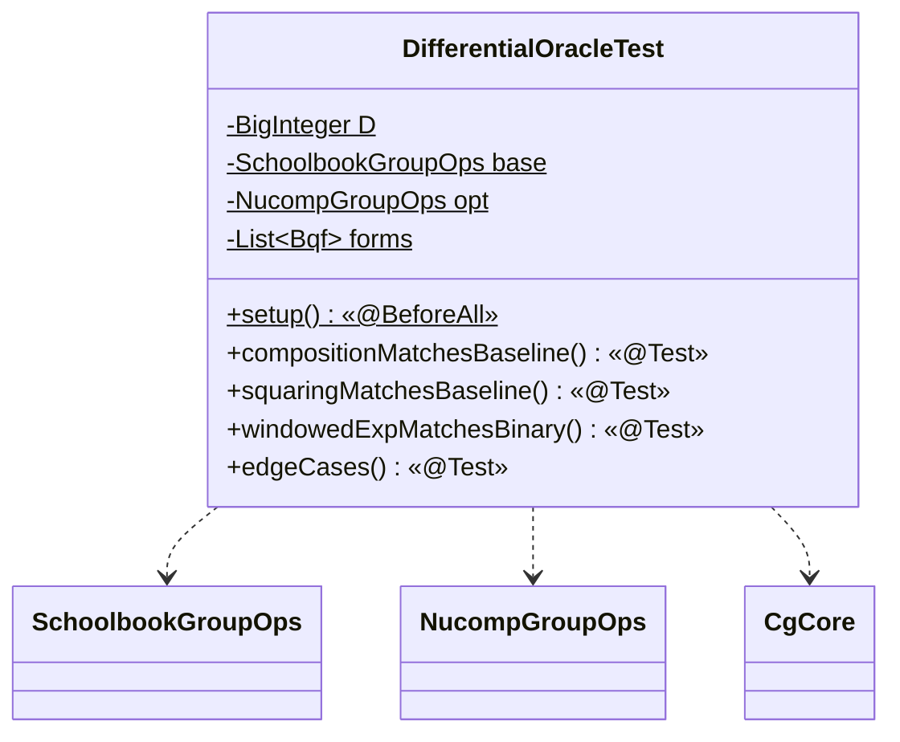
```mermaid
classDiagram
    class DifferentialOracleTest {
        -BigInteger D$
        -SchoolbookGroupOps base$
        -NucompGroupOps opt$
        -List~Bqf~ forms$
        +setup()$  «@BeforeAll»
        +compositionMatchesBaseline() «@Test»
        +squaringMatchesBaseline() «@Test»
        +windowedExpMatchesBinary() «@Test»
        +edgeCases() «@Test»
    }
    DifferentialOracleTest ..> SchoolbookGroupOps
    DifferentialOracleTest ..> NucompGroupOps
    DifferentialOracleTest ..> CgCore
```

### 8.2 Differential oracle sequence diagram

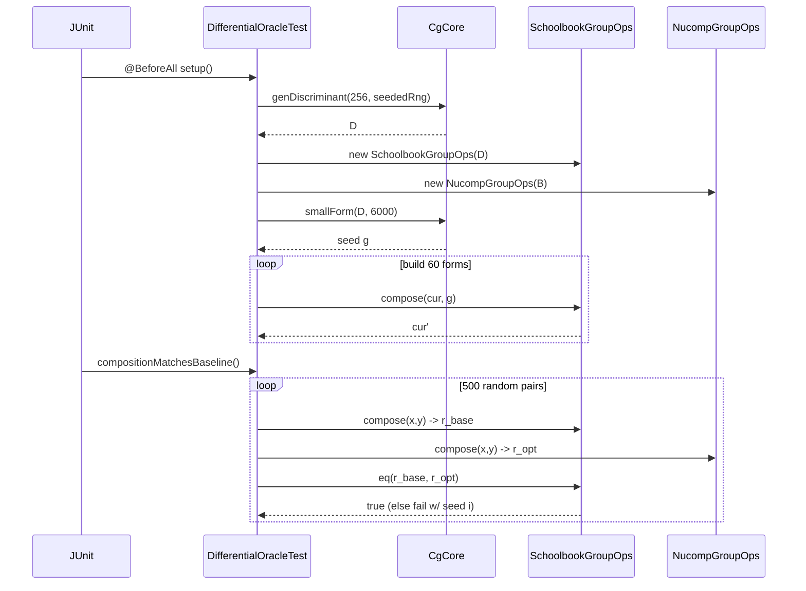
```mermaid
sequenceDiagram
    participant JUnit
    participant T as DifferentialOracleTest
    participant C as CgCore
    participant B as SchoolbookGroupOps
    participant O as NucompGroupOps
    JUnit->>T: @BeforeAll setup()
    T->>C: genDiscriminant(256, seededRng)
    C-->>T: D
    T->>B: new SchoolbookGroupOps(D)
    T->>O: new NucompGroupOps(B)
    T->>C: smallForm(D, 6000)
    C-->>T: seed g
    loop build 60 forms
        T->>B: compose(cur, g)
        B-->>T: cur'
    end
    JUnit->>T: compositionMatchesBaseline()
    loop 500 random pairs
        T->>B: compose(x,y) -> r_base
        T->>O: compose(x,y) -> r_opt
        T->>B: eq(r_base, r_opt)
        B-->>T: true (else fail w/ seed i)
    end
```

### 8.3 Test matrix (exact)

| Test | Inputs | Assertion |
|---|---|---|
| `compositionMatchesBaseline` | 500 random form pairs | `base.eq(base.compose, opt.compose)` |
| `squaringMatchesBaseline` | all 60 forms | `base.eq(base.square, opt.square)` |
| `windowedExpMatchesBinary` | 100 random (form, k<10⁶) | `base.eq(base.exp, windowed.exp)` |
| `edgeCases` | identity, inverse, k=0, k=1 | algebraic identities hold |

### 8.4 Edge cases the team must add as NUCOMP lands
- ambiguous forms: `b=0`, `a=c`, `|b|=a`
- exponents `0`, `1`, near group-order size
- smallest and largest target discriminant (512 … 3072 bits)
- failing-seed capture: on mismatch, log the `SecureRandom` seed + indices so the
  exact case reproduces.

---

## 9. Component `cg-bench` + `report/` (Owner: G25AIT2134)

### 9.1 Class diagram

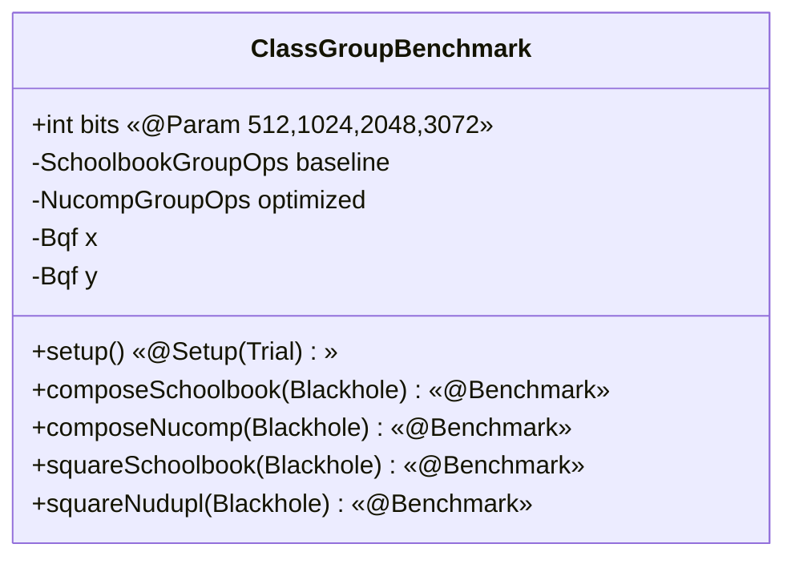
```mermaid
classDiagram
    class ClassGroupBenchmark {
        +int bits  «@Param 512,1024,2048,3072»
        -SchoolbookGroupOps baseline
        -NucompGroupOps optimized
        -Bqf x
        -Bqf y
        +setup()  «@Setup(Trial)»
        +composeSchoolbook(Blackhole) «@Benchmark»
        +composeNucomp(Blackhole) «@Benchmark»
        +squareSchoolbook(Blackhole) «@Benchmark»
        +squareNudupl(Blackhole) «@Benchmark»
    }
```

### 9.2 JMH configuration (exact, on the class)
`@BenchmarkMode(AverageTime)` · `@OutputTimeUnit(MICROSECONDS)` ·
`@State(Scope.Thread)` · `@Warmup(5×1s)` · `@Measurement(8×1s)` · `@Fork(1)` ·
`@Param bits = {512,1024,2048,3072}`. Every `@Benchmark` consumes its result via
`Blackhole.consume(...)` to defeat dead-code elimination.

### 9.3 Benchmark → report sequence

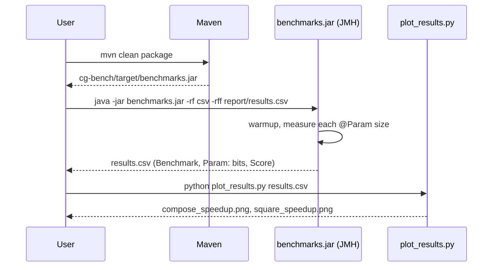
```mermaid
sequenceDiagram
    participant U as User
    participant M as Maven
    participant J as benchmarks.jar (JMH)
    participant P as plot_results.py
    U->>M: mvn clean package
    M-->>U: cg-bench/target/benchmarks.jar
    U->>J: java -jar benchmarks.jar -rf csv -rff report/results.csv
    J->>J: warmup, measure each @Param size
    J-->>U: results.csv (Benchmark, Param: bits, Score)
    U->>P: python plot_results.py results.csv
    P-->>U: compose_speedup.png, square_speedup.png
```

### 9.4 Data contract: JMH CSV → plotter
`plot_results.py` reads columns `Benchmark` (uses the trailing method name),
`Param: bits` (int), `Score` (float µs). It pairs
`composeSchoolbook`↔`composeNucomp` and `squareSchoolbook`↔`squareNudupl`,
computes `speedup = base/opt`, and writes a twin-axis chart per operation.

---

## 10. End-to-end sequences

### 10.1 Full correctness run (`mvn test`)

```mermaid
sequenceDiagram
    participant Mvn as Maven (reactor)
    participant Core as cg-core tests
    participant Base as cg-baseline tests
    participant Test as cg-test (oracle)
    Mvn->>Core: CgCoreTest (encoding, floorDiv, roots, disc)
    Core-->>Mvn: pass
    Mvn->>Base: SchoolbookGroupOpsTest (group laws)
    Base-->>Mvn: pass
    Mvn->>Test: DifferentialOracleTest (opt vs base)
    Test-->>Mvn: pass  (trivially while opt delegates; real proof after NUCOMP)
    Mvn-->>Mvn: BUILD SUCCESS
```

### 10.2 The lifecycle of one composition call (control flow)

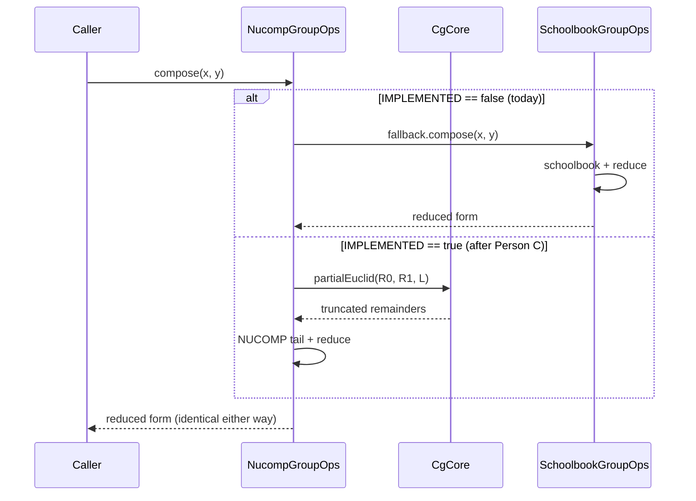
```mermaid
sequenceDiagram
    participant Caller
    participant O as NucompGroupOps
    participant C as CgCore
    participant B as SchoolbookGroupOps
    Caller->>O: compose(x, y)
    alt IMPLEMENTED == false (today)
        O->>B: fallback.compose(x, y)
        B->>B: schoolbook + reduce
        B-->>O: reduced form
    else IMPLEMENTED == true (after Person C)
        O->>C: partialEuclid(R0, R1, L)
        C-->>O: truncated remainders
        O->>O: NUCOMP tail + reduce
    end
    O-->>Caller: reduced form (identical either way)
```

### 10.3 Module build/dependency order (Maven reactor)

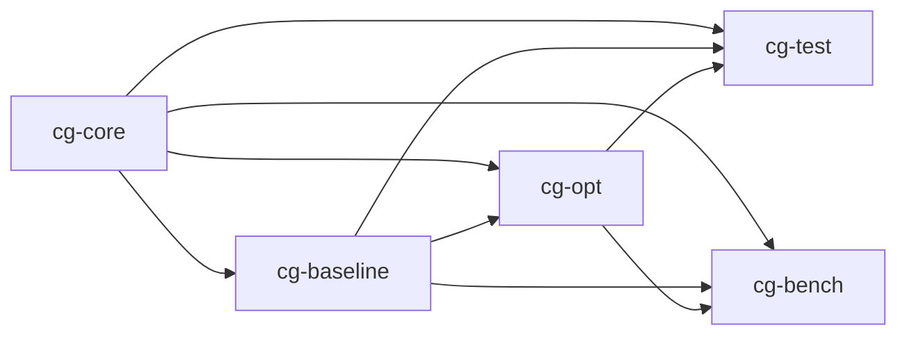
```mermaid
flowchart LR
    A["cg-core"] --> B["cg-baseline"]
    A --> O["cg-opt"]
    B --> O
    A --> T["cg-test"]
    B --> T
    O --> T
    A --> N["cg-bench"]
    B --> N
    O --> N
```

---

## 11. Error model, invariants & threading

### 11.1 Exception taxonomy

| Condition | Exception | Raised by |
|---|---|---|
| `(b²−D)` not divisible by `4a` | `FormException` | `Bqf.of` |
| operands of different discriminant | `FormException` | opt/baseline (add a guard) |
| `bits < 16` for discriminant | `ParamException` | `CgCore.genDiscriminant` |
| `toFixed` value too wide / negative | `IllegalArgumentException` | `CgCore.toFixed` |
| window not in 1..8 | `IllegalArgumentException` | `WindowedExp` ctor |

### 11.2 Invariants (assert in tests / debug builds)
- After any `GroupOps` result `r`: `is_reduced(r)` and `r.discriminant()==D`.
- `compose` is associative & commutative; `identity` is neutral; `inverse`
  inverts. (Property tests, §5.5.)
- `opt` output ≡ `baseline` output for the same inputs. (Oracle, §8.)

### 11.3 Threading & state
- All `GroupOps` are immutable post-construction → safe to share read-only.
- Tests construct fresh instances per class; JMH uses per-thread state.
- No static mutable state anywhere; `CgCore` is stateless utility methods.

### 11.4 What "leave nothing missing" means here — closure checklist
- [x] Every module has a class diagram with exact signatures.
- [x] Every algorithm has an activity diagram (reduce, compose, partialEuclid,
      NUCOMP, NUDUPL, windowed exp).
- [x] Inter-component contracts enumerated (§3.1) with exact types.
- [x] Construction wiring specified (§3.2).
- [x] Sequence diagrams for the oracle, the benchmark→report flow, the build,
      and a single compose call.
- [x] Error taxonomy, invariants, threading (§11).
- [ ] **Open items the team fills:** real NUCOMP/NUDUPL bodies (§6), wNAF +
      Pippenger (§7.3), `SchoolbookGroupOpsTest` source (assertions specified in
      §5.5), per-`D`-mismatch guards (§11.1).

---

*Companion to: ClassGroup_Optimization_Design.md, Abstract_Study_Notes.md,
Worked_Example_Schoolbook_vs_NUCOMP.md, and the trout-classgroup-opt code
skeleton. Disclaimer: academic coursework; not audited; not for production use.*
